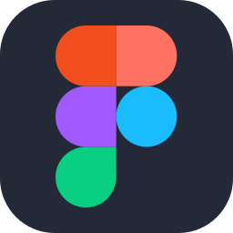

## About Me 😄

Hi, I'm Yui Jensen! I'm a passionate developer with a knack for creating efficient, scalable solutions. My journey in tech spans web development, automation, and data analysis. I'm always excited to learn new technologies and collaborate on exciting projects.

- 🌱 I’m currently exploring Typescript, Next.js and React.

- 🤝 I’m looking to collaborate on web development and open-source projects.
- 💬 Ask me about JavaScript and React.
- 📫 How to reach me: [jensenyui1122@gmail.com]
- ⚡ Fun fact: I can play the drums — so if coding ever needs a beat, I’ve got it covered. 😎🎶
- 💜 My Portfolio [https://yui9667.github.io/portfolio-y/]

## Tools I Use 🛠️

  

